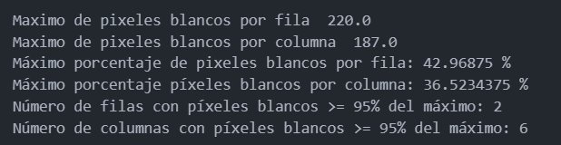
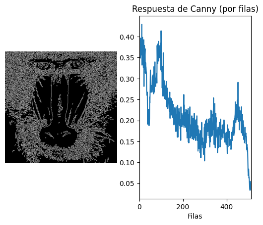

# Práctica 2. Funciones básicas de OpenCV

## Autores

## Tecnologias
  -  Python: 

## Bibliotecas
  - OpenCV: 
  - Matplotlib: 
  - NumPy: 

## Índice
1. [Histograma pixeles blancos por filas](#histfilas)
2. [Umbralizado de la imagen](#umbralizado)
4. [Pop art con detección de bordes](#popart)
5. [Detección de movimiento](#movimiento)

## Histograma pixeles blancos por filas 

Este ejercicio consiste en:
-   ReaEste ejercicio consiste en:
- Realizar la cuenta de píxeles blancos por filas.
- Normalizar los valores de los píxeles en base al valor máximo del píxel (255).
- Determinar el máximo de píxeles blancos por fila y columna.
- Calcular el número de filas y columnas con un número de píxeles blancos mayor o igual que el 95% del máximo.
- Mostrar gráficamente la distribución de píxeles blancos por fila.

El código realiza los siguientes pasos:
1. Cuenta los píxeles blancos por filas y normaliza los valores.
2. Determina el máximo de píxeles blancos por fila y columna.
3. Calcula el umbral del 95% del máximo de píxeles blancos.
4. Cuenta el número de filas y columnas que superan este umbral.
5. Muestra gráficamente la distribución de píxeles blancos por fila.

Dicha gráfica muestra la distribución de píxeles blancos por fila en la imagen procesada. Los puntos más altos en la gráfica representan las filas con mayor cantidad de píxeles blancos. 

En este caso solo hay 2 picos donde la fila supera el 95% del máximo. En el caso de columnas hay 6. 
 

## Umbralizado de la imagen 

   Se ha aplicado umbralizado a la imagen resultante de Sobel, y posteriormente se ha realizado el conteo por filas y columnas. Se han calculado los máximos por filas y columnas, y determinado las filas y columnas por encima del 0.95\*máximo. Además se ha remarcado esas filas dentro de la imagen original con filas azules y en el histograma con filas rojas.
   

## Pop art con detección de bordes 

Al pop art de la práctica anterior se le ha agregado detección de bordes, para que sea más estético. Manteniendo la interactividad que ya tenia con las teclas "q" y "e", para aumentar o reducir el número de marcos y con "w" y "s", para modíficar el filtro del marco.

## Detección de movimiento 

Este ejercicio implementa un sistema de detección de movimiento utilizando OpenCV. El código captura video desde la cámara, detecta movimiento en los fotogramas y dibuja rectángulos alrededor de las áreas con movimiento. Además, se muestra una estela de los últimos rectángulos detectados.

En este ejercicio se ha utilizado desenfoque gaussiano con umbralización para reducir el ruido y detectar diferencias de movimiento. Además, se realiza la detección de contornos para identificar las áreas con movimiento, y se filtran los contornos pequeños para mejorar la precisión. La dilatación se aplica para unir áreas de movimiento cercanas y mejorar la detección. Finalmente, se suavizan los rectángulos detectados para una transición más fluida y se dibuja una estela de los últimos rectángulos detectados.

