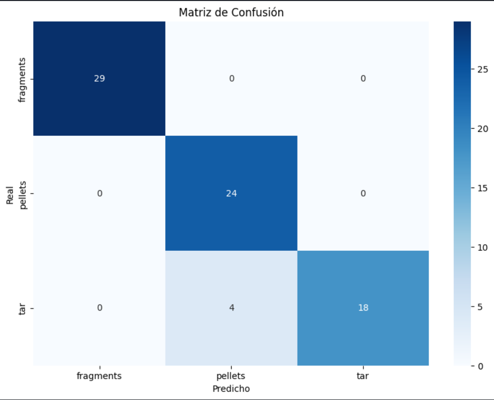
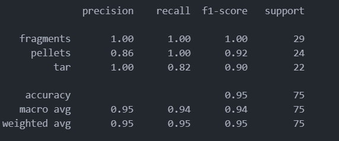

Práctica 3.

## Autores

## Tecnologias
  -  Python: 

## Bibliotecas
  - OpenCV: 
  - Matplotlib: 
  - NumPy: 

## Índice
1. [Introducción](#introducción)
2. [Tarea 1: Detección y Clasificación de Monedas Europeas](#tarea-1-detección-y-clasificación-de-monedas-europeas)
   - 1.1 [Descripción general](#descripción-general)
   - 1.2 [Escalado de imágenes usando 1 euro](#escalado-de-imágenes-usando-1-euro)
   - 1.3 [Características utilizadas](#características-utilizadas)
   - 1.4 [Detección del valor de las monedas](#detección-del-valor-de-las-monedas)
3. [Tarea 2: Clasificación de Imágenes con Random Forest](#tarea-2-clasificación-de-imágenes-con-random-forest)
   - 2.1 [Descripción general](#descripción-general-2)
   - 2.2 [Extracción de características](#extracción-de-características)
   - 2.3 [Entrenamiento del modelo](#entrenamiento-del-modelo)
   - 2.4 [Evaluación del rendimiento](#evaluación-del-rendimiento)
4. [Conclusión](#conclusión)

## Introducción
Este proyecto se divide en dos tareas principales:

1. **Clasificación y detección de monedas**: Utilizando técnicas de procesamiento de imágenes, se identifica el valor de diferentes monedas presentes en una imagen, basándose en el radio y color de las mismas.
2. **Clasificación de tipos de materiales**: Se clasifican fragmentos, pellets y residuos de alquitrán (tar) utilizando un clasificador Random Forest. Para ello, se extraen características geométricas y texturales de los contornos de los objetos en las imágenes.

## Tarea 1: Detección y Clasificación de Monedas Europeas

Se aplica el algoritmo de Hough Circle Transform para detectar las monedas en la imagen. Esta técnica permite encontrar objetos circulares dentro de una imagen, filtrando el ruido mediante un desenfoque gaussiano.

Los círculos detectados representan las monedas, y cada círculo es dibujado sobre la imagen.

El usuario debe hacer clic en una moneda de 1 euro para establecer una escala de referencia. Esto permite relacionar los radios de las monedas detectadas con su tamaño real en milímetros.

Se analiza el color promedio de cada moneda dentro de un radio ajustado para identificar su tipo. Dependiendo del valor de tono en el espacio de color HSV, se determinan las características cromáticas de la moneda (tonos de cobre, oro, y plata).

Con la escala y el color promedio, el sistema clasifica la moneda haciendo una comparación con un diccionario de valores de referencia de las monedas europeas.

## Tarea 2: Clasificación de Imágenes con Random Forest

Se cargan imágenes de tres categorías: fragmentos, pellets, y tar.
Se convierte cada imagen a escala de grises, se aplica un desenfoque gaussiano para eliminar el ruido, y luego se utiliza el método de umbralización de Otsu para segmentar las imágenes.

Para cada contorno detectado en las imágenes segmentadas, se extraen varias características geométricas:

- Área
- Perímetro
- Compacidad
- Relación de aspecto (aspect ratio)
- Relación entre ejes mayor y menor de la elipse ajustada
- Solidez (relación entre el área del contorno y el área de la envolvente convexa)

Además, se utiliza el histograma de la imagen en escala de grises para obtener características de textura, que se reducen a 32 bins.

Se utilizan técnicas de aumento de datos para mejorar la generalización del modelo, como:
- Inversión horizontal
- Rotación de la imagen
- Ajuste de brillo
- Desenfoque gaussiano

Se utiliza un RandomForestClassifier para entrenar el modelo con las características extraídas.
Se dividen los datos en conjuntos de entrenamiento y prueba (70% y 30% respectivamente), y se entrena el modelo con 100 árboles de decisión.

Para la evaluación se genera una matriz de confusión y un reporte de clasificación para evaluar el rendimiento del modelo. También se visualiza la matriz de confusión usando una gráfica de calor (heatmap), y se imprimen las métricas de precisión, recall, y F1-score.

Estos son los resultados:

Nos pareció que el porcentaje de acierto de 95% era suficiente. 
