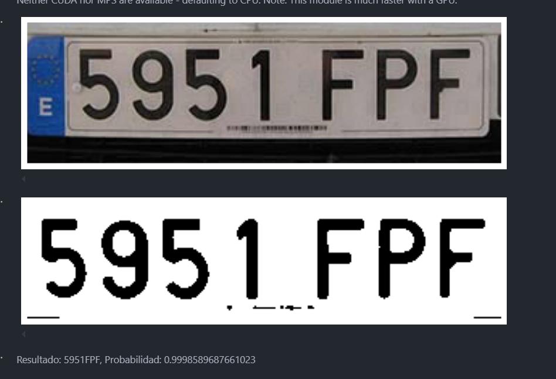
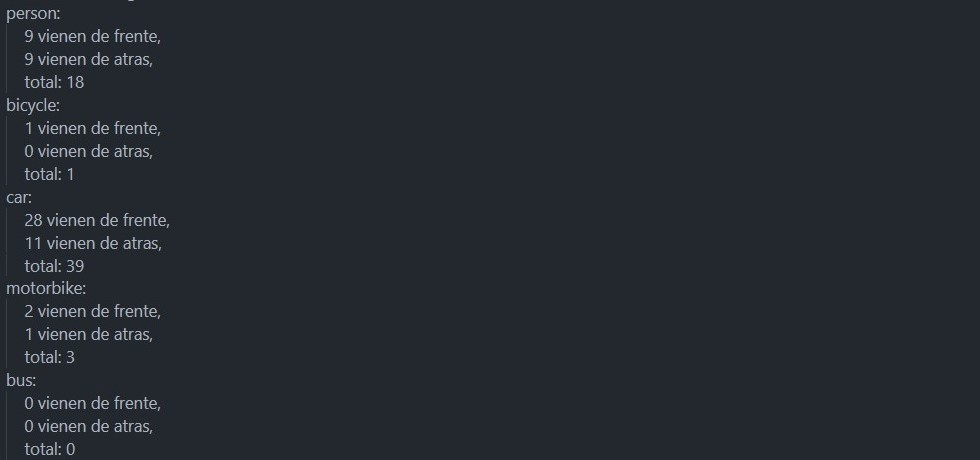

# Práctica 4. Reconocimiento de matrículas

## Autores
[](https://github.com/ElenaMoralesGil)

[](https://github.com/DevGiovanniLC)

---
## Tecnologias
  -  Python: 

## Bibliotecas Utilizadas

- **OS**: 
  - **Importación**: 
    ```python
    import os
    ```
  - **Descripción**: Biblioteca que proporciona funciones para interactuar con el sistema operativo, como la manipulación de archivos y directorios.
    
- **JSON**: 
  - **Importación**: 
    ```python
    import json
    ```
  - **Descripción**: Módulo para trabajar con datos en formato JSON (JavaScript Object Notation), permitiendo la conversión entre cadenas JSON y objetos de Python.
 

- **Random**: 
  - **Importación**: 
    ```python
    import random
    ```
  - **Descripción**: Módulo que implementa funciones para generar números aleatorios y seleccionar elementos al azar de secuencias.

- **Shutil**: 
  - **Importación**:
    ```python
    import shutil
    ```
  - **Descripción**: Biblioteca que ofrece una serie de funciones de alto nivel para operaciones de archivos, como copiar y mover archivos y directorios.


- **Torch**: 
  - **Importación**: 
    ```python
    import torch
    ```
  - **Descripción**: Biblioteca de aprendizaje profundo que proporciona herramientas para construir y entrenar modelos de redes neuronales.

- **OpenCV**: 
  - **Importación**: 
    ```python
    import cv2
    ```
  - **Descripción**: Biblioteca de visión por computadora utilizada para la manipulación de imágenes y detección de características como contornos y círculos.

- **EasyOCR**: 
  - **Importación**: 
    ```python
    import easyocr
    ```
  - **Descripción**: Biblioteca de reconocimiento óptico de caracteres (OCR) que permite extraer texto de imágenes.

- **CSV**: 
  - **Importación**: 
    ```python
    import csv
    ```
  - **Descripción**: Módulo para leer y escribir archivos en formato CSV (Comma-Separated Values).

- **Logging**: 
  - **Importación**: 
    ```python
    import logging
    ```
  - **Descripción**: Biblioteca que proporciona funcionalidades para el registro de mensajes y eventos en aplicaciones Python.

- **Ultralytics**: 
  - **Importación**: 
    ```python
    from ultralytics import YOLO
    ```
  - **Descripción**: Implementación de YOLO (You Only Look Once) para la detección de objetos en imágenes y videos.

- **Matplotlib**: 
  - **Importación**:
    ```python
    import matplotlib.pyplot as plt
    ```
  - **Descripción**: Biblioteca de visualización gráfica usada para mostrar imágenes, gráficas y resultados de análisis.
    
- **Ultralytics YOLO DetectionTrainer**: 
  - **Importación**:
    ```python
    from ultralytics.models.yolo.detect import DetectionTrainer
    ```
  - **Descripción**: Clase para entrenar modelos de detección utilizando el algoritmo YOLO de Ultralytics.
    
- **Ultralytics YOLO**: 
  - **Importación**: 
    ```python
    from ultralytics import YOLO
    ```
  - **Descripción**: Implementación de YOLO (You Only Look Once) para la detección de objetos en imágenes y videos.

---

## Índice
1. [Introducción](#introducción)
2. [Detector de matrículas (YOLO)](#detector-de-matrículas-yolo)
3. [Explicación general](#general)
   - [Anonimización de transeúntes y vehículos](#anonimización-de-transeúntes-y-vehículos)
   - [Identificación de texto (OCR)](#identificación-de-texto-ocr)
   - [Detección de dirección de transeúntes y vehículos](#detección-de-dirección-de-transeúntes-y-vehículos)


## Introducción
Este proyecto contiene  lo siguiente:
- Detector y seguimiento de las personas y vehículos presentes
- Detector y lector de  matrículas de los vehículos presentes
- Contador del total de cada clase
- Detector de flujo de personas y vehículos en distintas direcciones
- Anonimato de las personas y vehículos presentes
- Un archivo csv con el resultado de la detección y seguimiento.
- un vídeo que visualice los resultados

# Detector de matrículas (YOLO)

Se ha usado este dataset proporcionado en el proyecto, puedes utilizar el siguiente enlace:

[Dataset](https://alumnosulpgc-my.sharepoint.com/:u:/g/personal/elena_morales104_alu_ulpgc_es/EfKtczlxJQFIlWnynEJdK8gBURi6-WyTLEQyttN8zKxAuw?e=m1TvBb)

Este archivo contiene las imágenes y las etiquetas necesarias para entrenar el modelo de detección de matrículas en formato YOLO. Estas imágenes, son 290 imágenes de matrículas españolas recopiladas de [PlatesMania](https://platesmania.com/es/). El etiquetado de las imágenes se ha usado la herramienta Labelme. En el cuaderno se encuentra el código que hizo la distribución en 70% train, 20% val y 10% test, además de la conversión de formato labelme a YOLO. 

Para la detección de matrículas se ha decidido utilizar DetectionTrainer de Ultralytics. Este entrenador facilita la configuración y el entrenamiento de modelos YOLO.

Hay varios parámetros clave:
- model: Utiliza el modelo preentrenado yolo11n.pt.
- data: Define el archivo de configuración de datos license_plates.yaml.
- epochs: Se entrena durante 150 épocas.
- batch: Un tamaño de lote de 64 imágenes.
- imgsz: Tamaño de imagen de 640 píxeles.
- multi_scale: Permite el entrenamiento con imágenes de diferentes tamaños.
- workers: Usa 4 procesos para cargar datos en paralelo.
- device: Selecciona cuda si hay una GPU disponible.
- verbose: Activa la salida detallada del progreso.
- lr0: Tasa de aprendizaje inicial de 0.001.
- weight_decay: Penalización de 0.001 para evitar sobreajuste.
- patience: Permite 25 épocas sin mejora antes de detener el entrenamiento.
- augment: Habilita la aumentación de datos.

De este modelo que se encuentra en /runs/detect/train32/weight/best.pt se han sacado los siguientes resultados. 


Tanto en la pérdida como en la precisión se nota que en las primeras épocas le cuesta, pero luego rápidamente sobre la época 15 mejora considerablemente. Esta rápida mejora nos pareció un poco raro, pensabamos que quizás estaba memorizando las imágenes, pero cuando lo comprobamos en el video se ve que detecta muy bien las matrículas. 

# Explicación general 

Este proyecto está diseñado para realizar la detección y el seguimiento de personas y vehículos en video utilizando modelos de inteligencia artificial basados en la arquitectura YOLO (You Only Look Once). Las principales funcionalidades del código incluyen:

Detección de objetos: Utiliza el modelo YOLO para identificar y clasificar objetos en tiempo real en un video. Hay 2 modelos, uno general, yolo11n.pt, que reconoce cinco tipos de clases: personas, bicicletas, coches, motocicletas y autobuses. Y un segundo que es el modelo que detecta las matrículas, train32.pt, que ha sido creado por nosotros.

Seguimiento de objetos: Implementa un sistema de seguimiento que asigna un identificador único (ID de seguimiento) a cada objeto detectado, permitiendo rastrear su movimiento a lo largo de los fotogramas del video.

Reconocimiento de matrículas: Emplea un modelo especializado en la detección de matrículas de vehículos. Una vez que se detecta una matrícula, se aplica un sistema de OCR (Reconocimiento Óptico de Caracteres) para extraer el texto de la matrícula y su nivel de confianza.

Análisis de direcciones: Clasifica la dirección de movimiento de los objetos (si vienen de frente o de atrás) basándose en su posición horizontal en el marco del video.

Difuminado de imágenes para anonimato: El código aplica un desenfoque a las imágenes de las personas y vehículos detectados, mientras que las matrículas se mantienen visibles. 

Salida de datos: Los resultados de la detección se almacenan en un archivo CSV que incluye información como el tipo de objeto, el nivel de confianza, el identificador de seguimiento, las coordenadas del cuadro delimitador y, en caso de vehículos, la información de la matrícula.

Se implementa un sistema de anonimato para proteger la identidad de personas y vehículos en las imágenes y videos procesados. Esto se logra mediante un enfoque de desenfoque en áreas específicas de la imagen, asegurando que la información sensible no sea visible.

- **Difuminado de Personas:** Cuando se detecta una persona, se aplica un desenfoque (Gaussian Blur) en la región de interés (ROI) que ocupa. Esto garantiza que las personas no sean identificables en el video de salida.

- **Protección de Matrículas:** Para los vehículos, se detectan las matrículas utilizando un modelo YOLO especializado. Una vez identificadas, se realizan los siguientes pasos:

  - Las áreas donde se detectan las matrículas se mantienen nítidas y se les permite mostrar el texto de la matrícula bajo condiciones de confianza específicas.
  - Se aplica un desenfoque en el resto del vehículo, asegurando que las matrículas sean visibles, pero la información de contexto (como la imagen del vehículo) esté difuminada.
 
Generación de video de salida: El resultado del procesamiento se guarda en un nuevo archivo de video donde se destacan las detecciones y se muestra información adicional sobre cada objeto. Este archivo resultante se encuentra [aquí](https://alumnosulpgc-my.sharepoint.com/:v:/g/personal/elena_morales104_alu_ulpgc_es/ETVBdUMhXaRBnUolhiwRJTEBJwjz3SAbVRdcSkOJzAzSpw?e=yQCVO9&nav=eyJyZWZlcnJhbEluZm8iOnsicmVmZXJyYWxBcHAiOiJTdHJlYW1XZWJBcHAiLCJyZWZlcnJhbFZpZXciOiJTaGFyZURpYWxvZy1MaW5rIiwicmVmZXJyYWxBcHBQbGF0Zm9ybSI6IldlYiIsInJlZmVycmFsTW9kZSI6InZpZXcifX0%3D)

## Anonimización de transeúntes y vehículos

Este enfoque permite mantener un balance entre la utilidad del sistema de detección y la protección de la privacidad


## Identificación de texto (OCR)
El objetivo es detectar y extraer texto de imágenes, como matrículas de vehículos, utilizando la biblioteca EasyOCR y técnicas de procesamiento de imágenes con OpenCV. Intentando tener la mayor probabilidad de detección.

### 1. Función mostrar_imagen(imagen):*
Esta función recibe una imagen y la muestra utilizando Matplotlib. Convierte la imagen de BGR (formato usado por OpenCV) a RGB para su correcta visualización.

### 2. Función preprocesar_imagen(imagen):
Convierte la imagen a escala de grises, aplica desenfoque y umbralización para obtener una imagen binaria que facilita la detección de texto.

### 3. Función OCR(imagen):
Función principal que toma una imagen, la preprocesa y la pasa a través de la función de detección. Devuelve el resultado final del OCR.

### 4. Función procesar_deteccion(imagen_procesada):
Esta función ejecuta un ciclo para mejorar la detección de texto en la imagen procesada, actualizando el texto y la probabilidad de detección hasta que no haya mejoras.

### 5. Función postprocesar_imagen(imagen):
Realiza el post-procesamiento de la imagen, aplicando un desenfoque gaussiano y ajustando el contraste. Se asegura de que la imagen tenga dimensiones adecuadas.

### 6. Función detectar_texto(imagen_procesada):
Utiliza EasyOCR para detectar texto en la imagen procesada. Retorna la región de interés (ROI) donde se ha detectado texto, junto con el texto y su probabilidad de detección. Si hay varias detecciones intenta abarcar todo el área de la imagen.


Posteriormente, a la hora de la detección se le da prioridad de que la longitud del texto sea la adecuada, aunque la probabilidad de la imagen sea peor. Para optimizar que el resultado sea el más cercano posible al texto de la matrícula.




## Detección de dirección de transeúntes y vehículos
Toda la detección de la dirección se realiza en la siguiente función:
### Función detectar_direccion
La función detectar_direccion tiene como objetivo clasificar la dirección de objetos detectados en función de su posición en el fotograma. Los objetos detectados, que pueden ser personas, bicicletas o vehículos, se clasifican en dos categorías según su dirección aparente:

* "from_front": Indica que el objeto se está acercando desde el frente.
* "to_front": Indica que el objeto se está alejando o moviendo hacia el frente de la cámara.
Parámetros
* track_id (int): Identificador único del objeto en seguimiento. Cada objeto detectado tiene un track_id para diferenciarlo de otros.
label_name (str): Nombre de la clase del objeto (p. ej., "person", "bicycle", "car").
* x (int): Coordenada X del borde derecho del objeto en el fotograma.
frame (np.array): Imagen del fotograma actual, que se utiliza para obtener el ancho del fotograma.

#### Comprobación del estado del track_id: 

La función verifica si el track_id del objeto ya ha sido clasificado previamente como "from_front" o "to_front". Para ello, recorre todas las entradas en el diccionario datos. Si el track_id ya está en cualquiera de estas listas, se establece id_inside como True y no se realiza ninguna clasificación adicional para ese objeto en este fotograma.

#### Clasificación según la posición en el fotograma:

Si el track_id no ha sido clasificado aún (id_inside es False), se procede a la clasificación basada en el tipo de objeto (label_name) y su coordenada X (x):
Para personas y bicicletas: Se considera que vienen "de frente" (to_front) si están ubicadas en el 20% más cercano del fotograma a la izquierda o en el rango entre el 70% y el 95% del ancho del fotograma en la derecha. En caso contrario, se clasifican como "from_front".

Para otros objetos (vehículos): Los vehículos se clasifican como "from_front" si su coordenada X está en el 70% de la parte izquierda del fotograma, o como "to_front" si están en el 10% de la derecha (es decir, más allá del 90% del ancho del fotograma).
Almacenamiento en el diccionario datos: Según la clasificación, el track_id se añade a la lista correspondiente (from_front o to_front) dentro de la categoría especificada en label_name.

En el conteo final solo tiene los vehículos en circulación.No contabiliza los que están aparcados.




