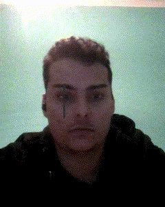

# Práctica 5. Detección y caracterización de caras

## Autores

## Tecnologías

## Descripción
Este proyecto aplica filtros de personajes de "One Piece" a caras en tiempo real utilizando la cámara. Cada filtro agrega elementos visuales distintivos de personajes (Zoro, Luffy, Brook y Chopper).

## Requisitos
1. **Instalar herramientas de C++**: [Visual Studio C++ Build Tools](https://visualstudio.microsoft.com/es/visual-cpp-build-tools/)
2. **Descargar el modelo de landmarks**: [shape_predictor_68_face_landmarks.dat.bz2](http://dlib.net/files/shape_predictor_68_face_landmarks.dat.bz2)
3. **Bibliotecas Python**:
   - `OpenCV`
   - `Dlib`
   - `DeepFace`
   - `Numpy`
   - `Random`

## Uso
Ejecutar el script para activar la cámara y aplicar filtros. Usa las siguientes teclas para interactuar:
- **Tecla "q"**: Cambia al filtro anterior
- **Tecla "e"**: Cambia al siguiente filtro
- **Tecla "Esc"**: Salir del programa

## Funcionalidades
- **Overlay de imágenes**: Superposición de imágenes PNG con transparencia sobre la cara detectada.
- **Detección de landmarks faciales**: Utiliza `dlib` para detectar landmarks de la cara.
- **Filtros específicos de personajes**:
  - **Zoro**: Añade cicatriz sobre el ojo izquierdo.
  - **Luffy**: Añade el sombrero y cicatriz en la mejilla.
  - **Brook**: Añade afro de Brook.
  - **Chopper**: Añade sombrero de Chopper.

