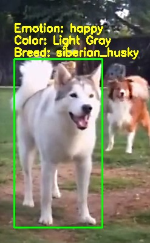
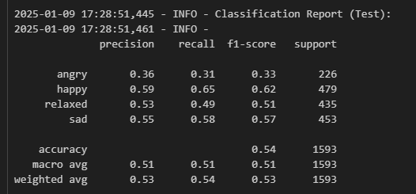
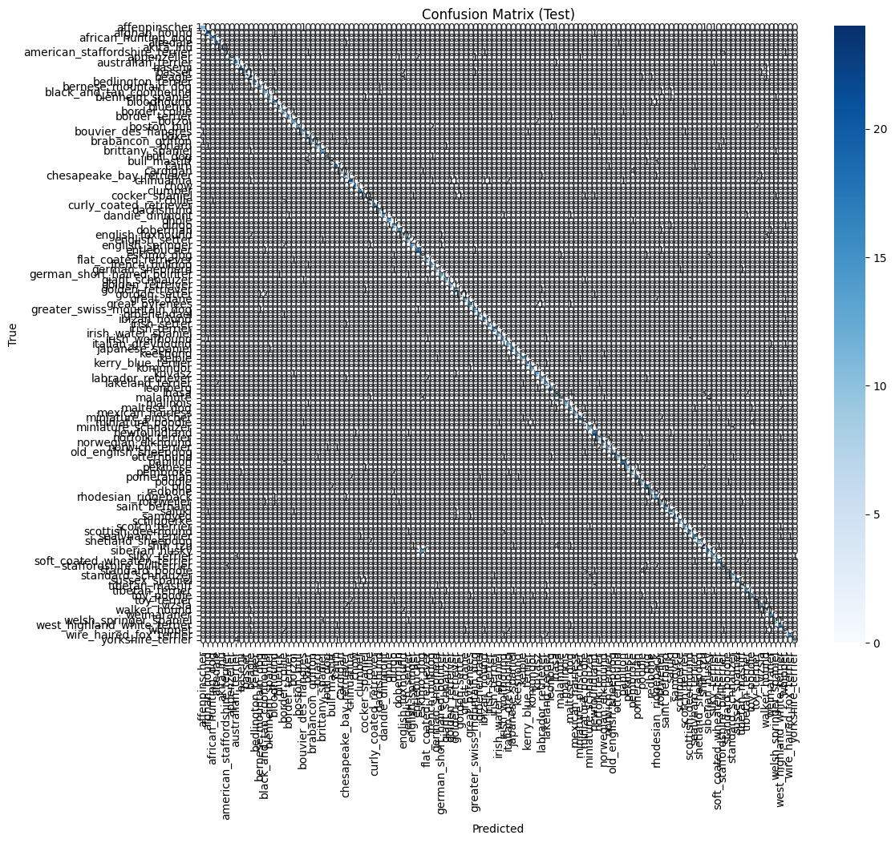
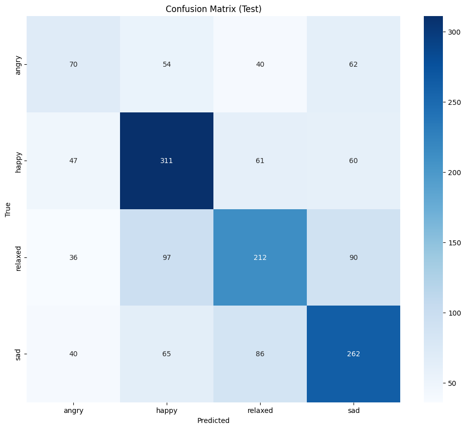
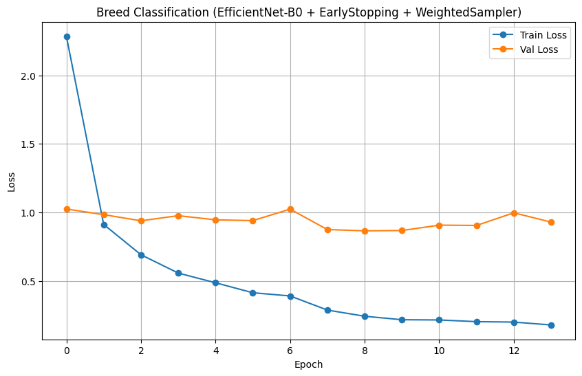
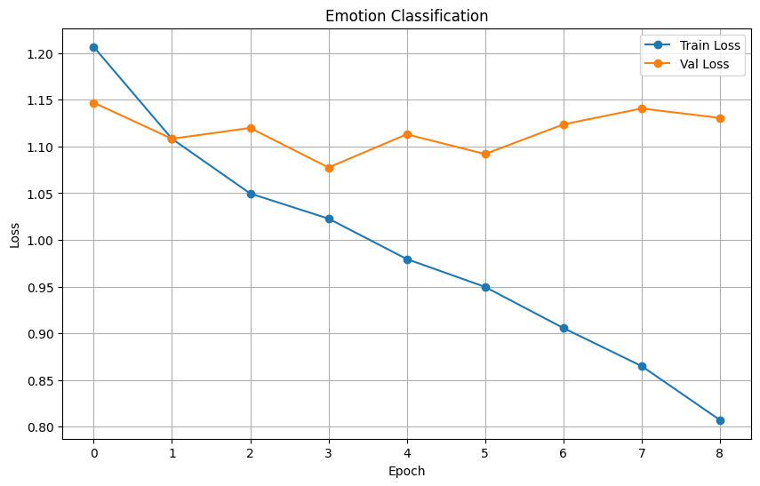

# Trabajo Final. Detección y seguimiento de perros (Raza, emociones, tamaño promedio, inteligencia, etc.)

## Autores

---
## Fuentes y tecnologías utilizadas

  

### Fuentes deDatos

Se han utilizado los siguientes datasets:

* **[Stanford Dogs Dataset](https://www.kaggle.com/datasets/jessicali9530/stanford-dogs-dataset)**: Ofrece imágenes y etiquetas de 120 razas de perros, proporcionando una amplia variedad para entrenar modelos de clasificación y detección.

* **[9 Dogs Breeds Identification & Classification](https://www.kaggle.com/datasets/muhammadhananasghar/9-dogs-breeds-identification-classification)**: Proporciona imágenes de 5 razas no incluidas en el Stanford Dogs Dataset, además de 4 razas ya presentes, con el fin de ampliar el conjunto de datos final para una mejor generalización y precisión en la identificación.

* **[Dog Emotions Prediction](https://www.kaggle.com/datasets/devzohaib/dog-emotions-prediction)**: Contiene imágenes etiquetadas según 4 estados emocionales diferentes.

* **[Dogs Intelligence and Size](https://www.kaggle.com/datasets/thedevastator/canine-intelligence-and-size/data?select=dog_intelligence.csv)**: Ofrece información detallada sobre razas de perros, incluyendo datos relacionados con la inteligencia y el tamaño, los cuales son utilizados para estimar características específicas durante el seguimiento y análisis.

### Modelos de Detección y Clasificación:

* **YOLOv11**: Utilizado para la detección y seguimiento de perros en videos.
* **ResNet50**: Empleado para la clasificación de razas y emociones de perros. Se aprovecha su arquitectura preentrenada para transferir conocimientos de ImageNet y adaptar la capa final a las clases específicas del proyecto.
* **EfficientNet-B0** : Mencionado como alternativa a ResNet50. A pesar de ser más ligero, no ofreció una mejora significativa en comparación con ResNet50 en este contexto.

### Librerías y Frameworks de Programación:

El proyecto hace uso de diversas librerías y frameworks esenciales para el desarrollo y la ejecución de sus funcionalidades. A continuación se listan y describen las principales:

* **Python 3.x**: Lenguaje principal utilizado para implementar los scripts y manejar el procesamiento de datos, entrenamiento y evaluación de modelos.

#### Manipulación de Archivos y Estructuras de Datos
- **os**, **glob**, **copy**: Gestión de rutas, archivos y copias de estructuras de datos.
- **logging**: Registro estructurado de eventos para depuración y monitoreo.
- **xml.etree.ElementTree**: Parseo de archivos XML, útil para extraer bounding boxes de anotaciones.
  
#### Procesamiento de Datos y Análisis
- **pandas**: Manejo y análisis de estructuras de datos tabulares.
- **numpy**: Cálculo numérico y manejo eficiente de arrays.

#### Imagen y Visión por Computador
- **PIL (Pillow)**: Manipulación básica de imágenes.
- **cv2 (OpenCV)**: Procesamiento avanzado de imágenes y video.
- **sklearn.cluster.KMeans**: Algoritmo de clustering para la detección del color dominante.

#### Aprendizaje Automático y Redes Neuronales
- **torch**, **torch.nn**, **torch.optim**: Base para el desarrollo y entrenamiento de redes neuronales con PyTorch.
- **torchvision**: Herramientas y modelos preentrenados (como ResNet50 y EfficientNet-B0) para visión artificial.
- **sklearn.model_selection**, **sklearn.metrics**: División de datos, validación y evaluación de modelos.

#### Manejo de Concurrencia y Estructuras de Control
- **queue.Queue**, **threading**: Implementación de hilos y colas para procesamiento en paralelo.

#### Visualización de Datos
- **matplotlib.pyplot**, **seaborn**: Generación de gráficos y visualización de datos para análisis.

#### Modelos y Utilidades del Proyecto
- **ultralytics.YOLO**: Modelo de detección de objetos YOLOv11 para identificar y seguir perros en video.
- **lib.Models**, **lib.Dataloader**, **lib.Enums**, **lib.RGBName**: Módulos personalizados que encapsulan la lógica específica del proyecto, como la definición de modelos, carga de datos y utilidades auxiliares.

## Motivación/argumentación del trabajo

Este proyecto se ha creado para facilitar la detección y seguimiento de perros identificado sus razas, emociones, color y tamaño(estándar). Ya que estás tareas pueden ser complicadas de hacer para una persona y creemos que utilizar modelos que detecten estas cualidades son útiles para muchos entornos como veterinarios, seguridad, personas con visión reducida o simplemente para que las personas sepan que clase de raza es su perro o, en el peor de los casos, a cual se parece más.

## Objetivos
El objetivo del proyecto es el de crear un sistema de detección y seguimiento de perros en un video, con la finalidad de poder identificar a los perros, obteniendo su color, su raza, su tamaño, su estado emocional.

El proyecto se ha adaptado para poder hacer esa identificación en tiempo real, gracias al uso de hilos y colas. Además, se ha usado varias optimizaciones para que el proceso de detección sea más rápido y eficiente.

## Descripción técnica

Las funcionalidades de detección son las siguientes:

* **Seguimiento de perros**: El sistema de seguimiento de perros se encarga de detectar y seguir a uno o varios perros en el video, esto se consigue gracias al uso de *YOLOv11*.

* **Detección de color**: El sistema de detección de color no es del todo preciso pero puede ser eficaz en base a la raza detectada, ya que la mayoría de los perros tienen un color dominante. Así funciona el sistema de detección de color, utilizando K-Means para obtener el color dominante de la región central de la imagen anteriormente recortada por yolo centrando al perro en esa imagen.
A partir de este color se puede obtener el nombre del color más cercano en inglés. para ellos usamos un archivo json que contiene los nombre de colores en inglés y sus valores RGB.

* **Detección de razas de perros**: El sistema de detección raza de perros se se realiza primeramente detenctando al perro en el video gracias a *YOLOv11*, y luego utilizando una red neuronal entrenada para poder identificar a los perros, *ResNet50*.

* **Detección de estado emocional**: El sistema de detección de estado emocional se realiza primeramente detenctando al perro en el video gracias a *YOLOv11* y posteriormente utilizando una red neuronal entrenada, *ResNet50* para identifica su estado emocional en base a una imagen.

* **Detección de tamaño**: El sistema de detección de tamaño se realiza primeramente detenctando al perro en el video gracias a *YOLOv11* y detectando la raza del perro a partir de la raza dell perro se puede obtener estimaciones de su tamaño promedio.

---

## Estructura del proyecto
El proyecto está dividido en diferentes scripts, los cuales se encargan de realizar diferentes tareas, empaquetando dichas funcionalidades en clases. Esto se hace, para poder subdividir el código y que sea más sencillo de visualizar y entender. Todos los scripts se encuentran en la carpeta `lib`. Todos ellos se usan entre si o se usa en el archivo `trabajo_final.ipynb`.

## Clasificación de Imágenes de Perros: Razas y Emociones

Uno de los objetivos del proyecto es crear modelos que clasifiquen imágenes de perros según su raza y emoción. Para ello, se han utilizado conjuntos de datos como Stanford Dogs, 9Breeds y un dataset de emociones caninas.

### Preprocesamiento de Datos

#### Recorte de Bounding Boxes
Para el dataset de Stanford Dogs, al contar con un etiquetado con bounding boxes, se parsean archivos XML asociados a cada imagen para extraer el bounding box principal y recortar la imagen en consecuencia. Esta técnica asegura que el modelo se enfoque en la región de interés que contiene al perro, mejorando la calidad de las características aprendidas y evitando procesar características irrelevantes.

#### Unificación de Datos
Se combinan datos de múltiples fuentes (Stanford Dogs y 9Breeds) en un único DataFrame para la clasificación de razas, y se procesan etiquetas de emociones para crear un DataFrame similar para emociones.

#### Estratificación
La división del dataset en conjuntos de entrenamiento, validación y prueba se realiza usando estratificación, asegurando que la distribución de clases se mantenga consistente en cada subconjunto. Esto ayuda a evitar desbalance en las clases.

### Aumento de Datos (Data Augmentation)

#### Transformaciones Básicas
Se aplican técnicas de data augmentation para enriquecer el conjunto de entrenamiento y mejorar la capacidad de generalización del modelo. Cambios como redimensionar imágenes, aplicar volteo horizontal aleatorio y rotaciones leves ayudan a reducir el riesgo de sobreajuste.

### Modelos Utilizados

#### ResNet50
Se utiliza una versión congelada para tareas de clasificación de razas y emociones, donde únicamente se entrena la capa final. Esto reduce el tiempo de entrenamiento y aprovecha características generales aprendidas en ImageNet.

#### EfficientNet-B0
Se implementan variantes basadas en EfficientNet-B0. Este modelo es más ligero, pero en el proyecto se observó que no aportaba una gran diferencia con ResNet50, dando peores resultados en comparación.

#### Personalización de la Capa Final
Para cada modelo, se reemplaza la capa final (fully connected) para adaptarla al número específico de clases de la tarea (razas o emociones). Se incorporan capas adicionales, activaciones ReLU y dropout para introducir no linealidad y regularización.

### Configuración del Entrenamiento

#### Optimización
Se utiliza el optimizador AdamW con funciones de pérdida como CrossEntropyLoss, considerando la opción de suavizado de etiquetas (label smoothing).

#### Scheduler
Se implementa un scheduler (ReduceLROnPlateau) que reduce la tasa de aprendizaje cuando la pérdida de validación no mejora, ayudando a afinar el modelo conforme avanza el entrenamiento.

#### Early Stopping
El entrenamiento se detiene tempranamente si la pérdida de validación no mejora tras un número definido de épocas consecutivas (patience). Esto previene el sobreajuste y ahorra tiempo de cómputo.

#### Weighted Random Sampling
Para manejar el desbalanceo de clases, se utiliza WeightedRandomSampler en los DataLoaders, asignando pesos inversamente proporcionales a la frecuencia de cada clase.

### Técnicas de Regularización y Mejora

#### Dropout
Se emplean capas de dropout en los clasificadores para evitar que el modelo se sobreajuste a los datos de entrenamiento.

#### Label Smoothing
El suavizado de etiquetas reduce la confianza extrema en las etiquetas verdaderas, lo cual mejora la generalización del modelo.

### Evaluación y Resultados
El código incluye funciones para evaluar los modelos en conjuntos de prueba:

- **Classification Report**: Se generan reportes detallados en el apartado de tests con precisión, recall y f1-score para cada clase.

En el caso de las razas se muestra la media dada por el report:

                                precision    recall  f1-score   support

                      accuracy                           0.80      2163
                     macro avg       0.81      0.80      0.80      2163
                  weighted avg       0.81      0.80      0.79      2163

Como se puede ver tiene una precisión y recall promedio sobre el 80%, lo cual consideramos un resultado decente pero no ideal.

La siguiente imagen muestra que al modelo le cuesta identidicar las emociones,lo cual es de esperar con un 50% de precisión. 

- **Confusion Matrix**: Se visualiza la matriz de confusión para identificar errores comunes de clasificación.

En el caso de las razas no se aprecia bien la matriz debido a la gran cantidad de clases 

La matriz muestra claramente que el modelo no ha llegado a comprender bien las diferencias entre las emociones, normal teiendo en cuenta que las razas son diferentes y las emociones son complicadas de captar.

- **Curvas de Pérdida**: Se grafican las curvas de pérdida de entrenamiento y validación a lo largo del tiempo para monitorear el comportamiento del modelo.

En el caso de las razas se puede ver que la gráfica muestra que la pérdida de entrenamiento disminuye constantemente, mientras que la pérdida de validación se estabiliza temprano, indicando que el modelo está aprendiendo pero podría estar comenzando a sobreajustarse. Esto se evidencia por la brecha entre ambas pérdidas. Aunque el modelo evita un sobreajuste severo gracias a técnicas como Early Stopping, aún podría mejorarse sin embargo durante varios días de entrenamiento no hemos podido arreglar ese sobreajuste y plateu en la validación.

Como se puede ver las emociones también experimentan un sobreajuste aunque tambien tienen una perdida medianamnete baja, parece ser qye en el entrenamiento ba bastante bien pero no se muestra lo mismo en validación, teniendo también plateu.

### Decisiones de Diseño

- **Modelo Base Preentrenado**:  
  Se eligieron probar modelos como ResNet50 y EfficientNet-B0 por su capacidad de transferencia y buen rendimiento en tareas de clasificación de imágenes. Se decidió utilizar ResNet50 debido a que daba mejores resultados en este contexto.

- **Congelamiento Parcial**:  
  Inicialmente se congela la mayor parte del modelo y solo se entrena la capa final para ahorrar tiempo. Luego se exploran técnicas más complejas si es necesario.

- **Data Augmentation**:  
  Se utilizan transformaciones para mejorar la robustez, con la flexibilidad de ajustar la agresividad según los recursos y resultados.

- **Balance entre Complejidad y Rendimiento**:  
  Se ofrecen configuraciones más simples para entornos con limitaciones de tiempo y computación, y configuraciones más complejas para maximizar la precisión cuando los recursos lo permiten.

- **Uso de Logging y Monitoreo**:  
  Se incorporó la librería `logging` para una salida estructurada y fácil de seguir, mejorando la depuración y el análisis de resultados.

## Uso
El proyecto se puede ejecutar con el archivo `trabajo_final.ipynb` este ejecutara todos los scripts y realizará la detección y seguimiento de los perros en el video, mostrando un rectangulo donde ubica cada perro en el video además de mostrar su raza, estado emocional, color y tamaño.

Si se quiere entrenar los modelos el codigo correspondiente se encuentran en cnn_training_validation.ipynb, para ejecutar el codigo se necesita descargar la siguiente [carpeta](https://alumnosulpgc-my.sharepoint.com/:u:/g/personal/elena_morales104_alu_ulpgc_es/ESux6XXsaBlHnozWWeoWoIUB9LO_wOzptLvZ5wBBCyaChQ?e=O8Oanj) donde se encuentran los datasets y ponerla en la carpeta Trabajo. 

## Conclusiones y propuestas de ampliación

Nos hubiera gustado mostrar mejores resultados con aciertos superiores al 90%. Quizas si hubueramos utilziado otras redes neuronales más modernas, como ResNeXt,Inception-v4  o Vision Transformers, por ejemplo, podríamos haber tenido mejores resultados. A pesar de eso seguimos considerando que no han sido resultados malos teniendo en cuenta lo variables que son las razas y aún más las emociones. Si ya les cuesta a otros modelos profesionales detectar las emociones de os humanos, no nos imaginamos lo complicado que es detectar las de los perros. Por lo tanto consideramos que nuestro clasificador y detector sigue siendo útil. 

Como propuestas de ampliación podríamos probar con otras redes neuronales previamente comentadas para comprobar si dan mejores resultados. También podríamos ofrecer mayor informacion sobre los perros como una mejor deteccion del color ( que detecten varios colores) y mayor información relevante sobr elos mismos, por ejemplo si es una raza peligrosa. 

## Diario global del grupo

Los primeros días estuvimos buscando datasets e investigando que herramientas y redes neuronales usar. Luego nos dividimos el trabajo una parte de detección de perros, color, y datos extras y otra parte del entrenamiento de los modelos para la deteccion de raza y emociones. Una vez completadas esas partes se hace esta memoria y el video.

## Créditos materiales no originales

Este proyecto utiliza materiales y recursos provenientes de fuentes externas que ya se han comentado y referenciado en el apartado de Fuentes.

## Enlace al código fuente

Este es el enlace a [GitHub](https://github.com/DevGiovanniLC/VC/tree/main/Trabajo) donde está el código fuente.

## Vídeo resumen
https://drive.google.com/file/d/1gNX92ya_z7MIjGDLeDqleQ-SUB4cC8m0/view?usp=sharing]
---

## Adversidades tecnicas encontradas durante el desarrollo
Al hacer uso del modelo de yolo, se ha encontrado que el modelo no es muy preciso en la detección de perros, tiende a confundir constantemente a perros con vacas, asi que si en algún momento se detecta a un perro pero posteriormente se identifica como una vaca, se considera que sigue siendo un perro y se realizara el seguimiento del mismo.
